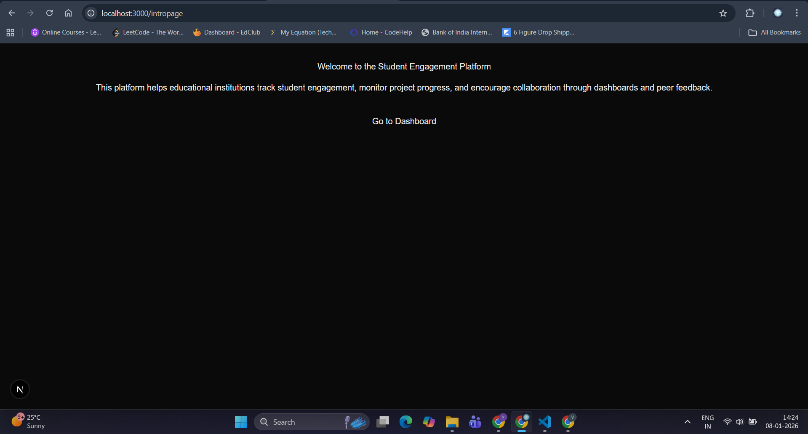

# Student Engagement & Collaboration Platform

Educational institutions often lack visibility into student engagement and project progress.
This project aims to improve collaboration and learning outcomes by providing dashboards
and peer feedback mechanisms for students and instructors.

This repository contains the base setup for the project using **Next.js (TypeScript)**
with a clean and scalable folder structure.

---

## 🚀 Tech Stack

- Next.js (App Router)
- TypeScript
- Node.js
- ESLint
- PostCSS
- Tailwind CSS (optional styling support)

---

## 📁 Folder Structure

```
    src/
    ├── app/ # Routes, layouts, and pages (Next.js App Router)
    │ ├── intropage/ # Intro / landing page
    │ ├── dashboard/ # Dashboard route (future work)
    │ ├── page.tsx # Home route
    │ ├── layout.tsx # Root layout
    │ └── globals.css # Global styles
    ├── components/ # Reusable UI components
    ├── lib/ # Utility functions and shared helpers
    public/ # Static assets
```


### Folder Purpose

- **app/**  
  Contains all route definitions using the Next.js App Router.  
  Each folder represents a route in the application.

- **components/**  
  Holds reusable UI components such as navigation bars, cards, and layout elements.
  This keeps UI logic separate from routing.

- **lib/**  
  Contains helper functions, constants, and shared utilities used across the app.

- **public/**  
  Stores static assets such as images and icons.

This structure improves modularity, readability, and scalability for future sprints.

---

## 🧭 Intro Page

The application includes an intro page located at:

    /intropage


This page introduces the platform’s purpose and provides a starting point
before navigating to dashboards and other features.

---

## ⚙️ Setup Instructions

### 1. Install dependencies
```bash
npm install


npm run dev


http://localhost:3000

```



